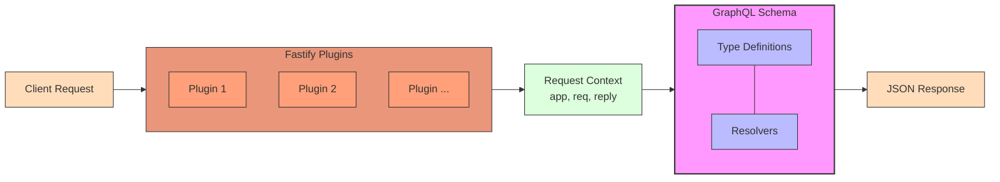

# GraphQL 서버 Setting

## GraphQL?

- DataLoader를 통해 마이크로서비스의 Query API **설계 방향성**을 제시 (기준이 된다고 이해함)
- 분산되어있는 데이터를 조합하는 형태(하나의 페이지에서 여러 api를 호출해 조합하는 등..)에 용이하다
  - `Gatsby`등의 SSG 프레임워크, `GraphQL Federation`등의 모델로써 개념이 활용되고 있다
- GraphQL의 클라이언트 라이브러리 `Relay`는 프론트개발자에게 좋은 성장의 계기가 된다고 함 (다음주차 주제)

## 서버 설정하기



- `GraphQL Yoga` 도구를 사용
  - `Apollo Server`, `Mercurius`등의 다른 도구도 있음
    - `Apollo Server`는 `Apollo Studio`라는 SASS 서비스를 활용할 수 있으나 폐쇠적임
  - 비교적 확장성이 가장 좋다
    - `the-guild-dev` 에서 다양한 플러그인을 활용할 수 있음

### Context

- 매 요청마다 새롭게 생성되는 객체 (세번째 인자로 전달된다)

  - 공용 객체를 모두 넣기보다, `Fastify`의 `app , req`만 전달하는게 좋다
  - 공용 객체에 대한 의존관리는 `Fastify`에 일임하는 방식
  - ```
     // 요청에 대해 매번 context 생성
      const context : Context ={
        app,
        req
      };

      // context가 스키마에 들어간다
      const response = await yoga.handleNodeRequestAndResponse(req, reply, context);
    ```

### Typescript 지원

- `GraphQL Code Generatoin` 사용

  - ```
     yarn add --dev \
    @graphql-codegen/cli \
    @graphql-codegen/schema-ast \
    @graphql-codegen/typescript \
    @graphql-codegen/typescript-resolvers
    ```

  ```

  ```

- 특정 `폴더 경로`를 입력하면 해당 graphql파일들을 읽어서 한꺼번에 만들도록 처리
  - 하나의 파일로 타입이 만들어지며 이를 활용해서 처리한다.

### DataLoader문제와 N+1

- `DataLoader` : N+1 문제를 해결할 수 있게 도와주는 라이브러리
  - 요청마다 공유되는 자원이므로 `Req` 스코프 내에 정의해야한다.
  - `Fastify Plugin`을 생성 후 여기에 설정
  - 결국 플러그인으로 관리해서 context로부터 값을 가져와서 다른 플러그인의 값들을 활용한다

### Saas 플러그인 붙여보기 (확장성이 좋다!)

- **파괴적 변환이 발생하는 스키마변경에 대해 안전망을 추가해보자**
  - `GraphQL Hive`
  - 스키마 변경사항을 한눈에 보여주고, 특정 기간동안 해당 콜이 사용된 횟수를 지표화해줌
  - 만약 사용된 횟수가 많다면 변경 시 에러가 발생한다
    - 클라쪽에서 사용하지 않도록 수정 후 일정 시간을 거치거나, 강제로 업데이트 쳐야함
    - (모르는 곳에서 어딘가에서 사용되는 케이스가 있을 수 있는데 안전장치 역할을 해줌)

---

Q. 타입을 보통 따로 선언하지 않고 이렇게 라이브러리 도움을 받는 편인가?

- 스키마 First vs Code First (취향 차이인듯..)
  - 스키마 : 스키마를 먼저 작성 -> Codegen
  - Pothos : 타입스크립트로 먼저 다 작성 후 `toSchema`로 변환

Q. context를 매번 생성하면 비용측면에서 조심해야하지 않을까?

- 현 코드상에서 context정도를 만드는 것은 크게 문제되지 않는다.

Q. 만약 스키마가 커지면?

- `GraphQL Modules`를 활용해서 분리할 수 있다.
